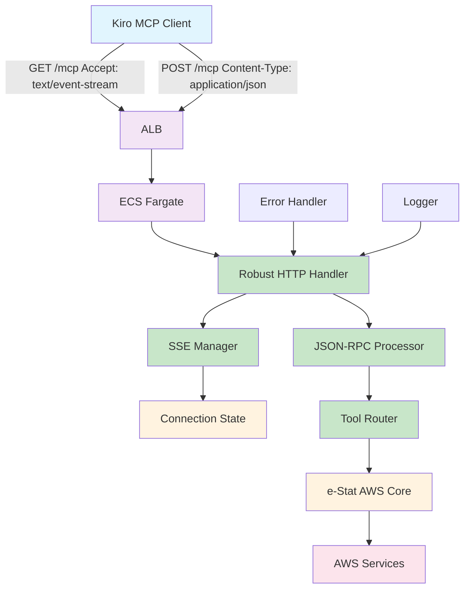

# Design Document: MCP Connection Stability

## Overview

このドキュメントは、e-Stat AWS MCPサーバーの接続安定性問題を体系的に分析し、最適なアーキテクチャを決定して、単一の確実なMCP実装を提供するための設計です。複数のトランスポートを並行して修正するのではなく、問題の根本原因を特定し、最も適したアプローチを選択します。

## Architecture

### Problem Analysis

#### Root Cause Investigation

**共通問題パターン:**
1. **初期化プロセスの複雑性**: 全てのMCPで初期化時にKiroがクラッシュ
2. **通信プロトコルの不整合**: JSON-RPC仕様との微妙な差異
3. **エラーハンドリングの不備**: 例外処理が不適切でプロセス全体に影響
4. **リソース管理の問題**: 接続やプロセスの適切なクリーンアップ不足

#### Transport Comparison Analysis

| Transport | 複雑度 | 安定性 | デバッグ容易性 | リモート対応 | 推奨度 |
|-----------|--------|--------|----------------|------------|--------|
| streamable-http | 中 | 中 | 中 | 高 | ⭐⭐⭐⭐ |
| stdio | 低 | 高 | 高 | 低 | ⭐⭐⭐ |
| http-wrapper | 中 | 低 | 中 | 中 | ⭐⭐ |

**結論: streamable-httpトランスポートを修正して使用**

### Selected Architecture: Robust Streamable-HTTP MCP



**設計原則:**
1. **明確な責任分離**: SSE接続管理とJSON-RPC処理を分離
2. **即座の応答**: 接続確立時に即座に初期化メッセージを送信
3. **適切なエラー境界**: エラーが接続全体に影響しない設計
4. **標準準拠**: MCP streamable-http仕様に厳密に準拠

## Components and Interfaces

### 1. Robust HTTP Handler
**責任:** HTTP リクエストの振り分けとレスポンス管理

**インターフェース:**
```python
class RobustHTTPHandler:
    async def handle_request(self, request) -> web.Response
    async def handle_get_sse(self, request) -> web.StreamResponse
    async def handle_post_jsonrpc(self, request) -> web.Response
    def create_error_response(self, error: Exception) -> web.Response
```

### 2. SSE Manager
**責任:** Server-Sent Events接続の管理と初期化

**インターフェース:**
```python
class SSEManager:
    async def establish_connection(self, request) -> web.StreamResponse
    async def send_initialization(self, response: web.StreamResponse) -> None
    async def send_keepalive(self, response: web.StreamResponse) -> None
    async def cleanup_connection(self, response: web.StreamResponse) -> None
```

### 3. JSON-RPC Processor
**責任:** JSON-RPC 2.0メッセージの処理

**インターフェース:**
```python
class JSONRPCProcessor:
    async def process_message(self, message: dict) -> dict
    def validate_request(self, message: dict) -> bool
    def create_response(self, request_id: Any, result: Any) -> dict
    def create_error(self, request_id: Any, code: int, message: str) -> dict
```

### 4. Connection State Manager
**責任:** 接続状態の追跡と管理

**インターフェース:**
```python
class ConnectionStateManager:
    def register_connection(self, connection_id: str) -> None
    def unregister_connection(self, connection_id: str) -> None
    def get_active_connections(self) -> List[str]
    def is_connection_active(self, connection_id: str) -> bool
```

## Data Models

### HTTP Request Context
```python
@dataclass
class RequestContext:
    method: str  # GET or POST
    headers: dict
    connection_id: str
    timestamp: datetime
    
    def is_sse_request(self) -> bool:
        return (self.method == 'GET' and 
                'text/event-stream' in self.headers.get('Accept', ''))
    
    def is_jsonrpc_request(self) -> bool:
        return (self.method == 'POST' and 
                'application/json' in self.headers.get('Content-Type', ''))

### SSE Message
```python
@dataclass
class SSEMessage:
    event: Optional[str] = None
    data: str = ""
    id: Optional[str] = None
    retry: Optional[int] = None
    
    def format(self) -> str:
        lines = []
        if self.event:
            lines.append(f"event: {self.event}")
        if self.id:
            lines.append(f"id: {self.id}")
        if self.retry:
            lines.append(f"retry: {self.retry}")
        lines.append(f"data: {self.data}")
        lines.append("")  # Empty line to end message
        return "\n".join(lines)

### MCP Message (same as before)
```python
@dataclass
class MCPMessage:
    jsonrpc: str = "2.0"
    method: Optional[str] = None
    params: Optional[dict] = None
    id: Optional[Union[str, int]] = None
    result: Optional[dict] = None
    error: Optional[dict] = None
    
    def is_request(self) -> bool:
        return self.method is not None and self.id is not None
    
    def is_notification(self) -> bool:
        return self.method is not None and self.id is None
    
    def is_response(self) -> bool:
        return self.method is None and self.id is not None
```

## Correctness Properties

*A property is a characteristic or behavior that should hold true across all valid executions of a system-essentially, a formal statement about what the system should do. Properties serve as the bridge between human-readable specifications and machine-verifiable correctness guarantees.*

### Property 1: Connection Stability
*For any* MCP server configuration, when enabled, Kiro should maintain stable operation without crashes for at least 10 minutes of normal usage
**Validates: Requirements 1.1**

### Property 2: Error Message Clarity
*For any* connection error scenario, the system should provide clear error messages with specific error codes and actionable information
**Validates: Requirements 1.2, 4.2**

### Property 3: Timeout and Retry Behavior
*For any* network interruption, the system should implement proper timeout mechanisms and retry failed operations according to configured parameters
**Validates: Requirements 1.3**

### Property 4: Event Logging Completeness
*For any* connection event (establish, disconnect, error), the system should generate corresponding log entries with timestamps and relevant context
**Validates: Requirements 1.4, 4.1**

### Property 5: SSE Connection Establishment
*For any* streamable-http connection attempt, the server should establish SSE connection and send initialization confirmation within 5 seconds
**Validates: Requirements 2.1, 2.2**

### Property 6: JSON-RPC Response Format
*For any* valid JSON-RPC request, the server should respond with properly formatted JSON that conforms to the JSON-RPC 2.0 specification
**Validates: Requirements 2.3, 6.1**

### Property 7: Dual Protocol Handling
*For any* endpoint supporting both GET and POST methods, the server should handle SSE connections via GET and JSON-RPC messages via POST correctly
**Validates: Requirements 2.4**

### Property 8: Resource Cleanup
*For any* connection termination, the server should clean up all associated resources within 10 seconds
**Validates: Requirements 2.5**

### Property 9: Stdio Initialization Time
*For any* stdio MCP server startup, the process should complete initialization and be ready to accept requests within 5 seconds
**Validates: Requirements 3.1**

### Property 10: Line-based Protocol Compliance
*For any* stdio communication, messages should be exchanged using clean line-based protocol with proper JSON formatting
**Validates: Requirements 3.2**

### Property 11: Error Continuation
*For any* recoverable error, the server should log the error to stderr and continue normal operation without terminating
**Validates: Requirements 3.3**

### Property 12: Clean Process Termination
*For any* server shutdown signal, the process should terminate cleanly within 5 seconds without hanging
**Validates: Requirements 3.5**

### Property 13: Verbose Logging Control
*For any* debug mode activation, the system should output detailed logs while maintaining separation between application and protocol logs
**Validates: Requirements 4.3, 4.4**

### Property 14: Automatic Recovery
*For any* recoverable error condition, the system should attempt automatic recovery according to configured retry policies
**Validates: Requirements 4.5**

### Property 15: Configuration Compatibility
*For any* configuration file from a previous version, the system should either successfully load it or provide clear migration guidance
**Validates: Requirements 5.4**

### Property 16: Transport Selection Control
*For any* configuration with multiple transport options, the system should allow selective enabling/disabling of each transport type
**Validates: Requirements 5.5**

### Property 17: Schema Validation
*For any* tool definition, the system should provide complete and valid inputSchema that accurately describes required and optional parameters
**Validates: Requirements 6.2, 6.3**

### Property 18: MCP Method Support
*For any* MCP client connection, the server should support all required methods (initialize, tools/list, tools/call) with proper responses
**Validates: Requirements 6.4**

### Property 19: Notification Handling
*For any* notification message (id is null), the server should process it without sending a response
**Validates: Requirements 6.5**

### Property 20: Response Time Compliance
*For any* normal tool operation, the system should respond within 30 seconds or provide progress indicators for longer operations
**Validates: Requirements 7.1, 7.2**

### Property 21: Concurrent Request Handling
*For any* set of concurrent requests, the system should handle them efficiently without blocking or degrading performance significantly
**Validates: Requirements 7.3**

### Property 22: Connection Pooling
*For any* HTTP-based transport, the system should implement connection pooling to optimize resource usage
**Validates: Requirements 7.4**

### Property 23: Resource Management
*For any* resource-constrained environment, the system should implement proper resource limits and graceful degradation
**Validates: Requirements 7.5**

### Property 24: Configuration Validation
*For any* configuration change, the system should validate all settings before applying them and reject invalid configurations with clear error messages
**Validates: Requirements 8.1**

### Property 25: Health Check Availability
*For any* running server instance, health check endpoints should be available and respond with accurate status information
**Validates: Requirements 8.2**

### Property 26: Metrics Exposure
*For any* monitoring-enabled configuration, the system should expose connection status and performance metrics in a standard format
**Validates: Requirements 8.3**

### Property 27: Environment Configuration Override
*For any* environment-specific setting, the system should support configuration overrides through environment variables or configuration files
**Validates: Requirements 8.4**

### Property 28: Alerting Mechanism
*For any* critical issue detection, the system should trigger appropriate alerts through configured channels
**Validates: Requirements 8.5**

## Error Handling

### Simplified Error Strategy
1. **Catch All Exceptions**: メインループで全ての例外をキャッチ
2. **Log and Continue**: エラーをログに記録して処理を継続
3. **Standard Error Responses**: JSON-RPC仕様に準拠したエラーレスポンス
4. **No Complex Recovery**: 複雑な復旧処理は行わない

### Error Response Format
```python
def create_error_response(request_id: Optional[Union[str, int]], 
                         code: int, 
                         message: str) -> dict:
    return {
        "jsonrpc": "2.0",
        "id": request_id,
        "error": {
            "code": code,
            "message": message
        }
    }
```

### Standard Error Codes
- `-32700`: Parse error (Invalid JSON)
- `-32600`: Invalid Request (Invalid JSON-RPC)
- `-32601`: Method not found
- `-32602`: Invalid params
- `-32603`: Internal error

## Testing Strategy

### Focus Areas
1. **Basic Protocol Compliance**: JSON-RPC 2.0仕様準拠
2. **Message Exchange**: 正常なリクエスト/レスポンス処理
3. **Error Handling**: 例外発生時の適切な処理
4. **Kiro Integration**: 実際のKiroとの接続テスト

### Testing Approach
1. **Unit Tests**: 各コンポーネントの単体テスト
2. **Integration Tests**: stdio通信の統合テスト
3. **Manual Tests**: Kiroでの実際の動作確認
4. **Property Tests**: 重要な不変条件の検証