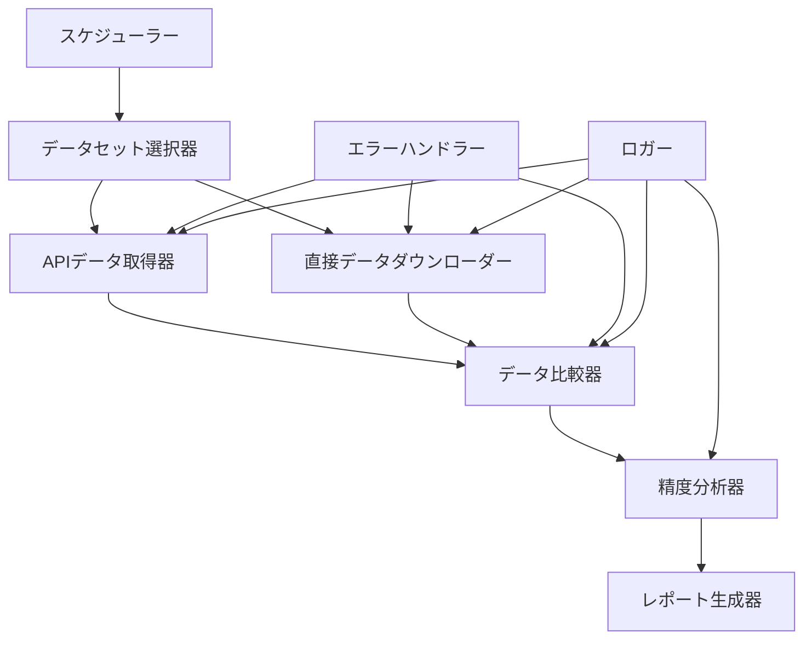

# 設計文書: MCPデータ精度検証システム

## 概要

このシステムは、API経由で取得したデータと公式e-Stat源からの正確なデータを比較することにより、MCP（Model Context Protocol）サーバーのデータ精度を包括的に検証します。システムは10の多様なデータセットにわたって自動テストを実装し、データ完全性、メタデータ精度、API信頼性を確保します。

検証プロセスは体系的なアプローチに従います：データセット選定 → APIデータ取得 → 直接データダウンロード → 比較分析 → 精度レポート。この設計により、異なるデータタイプ、サイズ、統計領域の包括的なカバレッジを確保し、定量的な精度メトリクスを提供します。

## アーキテクチャ

### システムコンポーネント



### データフロー

1. **データセット選定フェーズ**: 多様なキーワードでe-Statを検索し、代表的なデータセットを選定
2. **並列データ取得**: APIと直接ダウンロードで同時にデータを取得
3. **データ正規化**: 両方のデータセットを比較可能な形式に変換
4. **比較分析**: レコードレベルとメタデータレベルの比較を実行
5. **精度評価**: 精度、再現率、完全性メトリクスを計算
6. **レポート生成**: 包括的な精度レポートを作成

## コンポーネントとインターフェース

### データセット選択器

**目的**: 検証テスト用の多様なデータセットを特定・選定

**インターフェース**:
```python
class DatasetSelector:
    def search_with_keywords(self, keywords: List[str]) -> List[SearchResult]
    def select_representative_datasets(self, results: List[SearchResult]) -> List[Dataset]
    def ensure_size_diversity(self, datasets: List[Dataset]) -> List[Dataset]
    def validate_accessibility(self, datasets: List[Dataset]) -> List[Dataset]
```

**主要責任**:
- 10の異なる統計キーワードで検索を実行
- キーワードごとに1つの代表的なデータセットを選定
- サイズの多様性を確保（小：<10K、中：10K-100K、大：>100K）
- 二重アクセス可能性を検証（API + 直接ダウンロード）

### APIデータ取得器

**目的**: 完全なメタデータ分析とともにMCP API経由でデータセットを取得

**インターフェース**:
```python
class APIDataRetriever:
    def fetch_with_metadata(self, dataset_id: str) -> APIDataResult
    def calculate_completeness_ratio(self, metadata: Dict) -> float
    def extract_structure_details(self, data: Dict) -> StructureInfo
    def save_to_s3(self, data: Dict, metadata: Dict) -> S3Location
```

**主要責任**:
- MCPサーバー機能を使用してデータを取得
- 包括的なメタデータを抽出（OVERALL_TOTAL_NUMBER、カテゴリ、次元）
- 理論的対実際のレコード数を計算
- タイムスタンプとメタデータでデータを永続化

### 直接データダウンローダー

**目的**: e-Stat公式ソースから生データを直接ダウンロード

**インターフェース**:
```python
class DirectDataDownloader:
    def download_official_files(self, dataset_id: str) -> List[FileInfo]
    def parse_structured_data(self, files: List[FileInfo]) -> StructuredData
    def extract_official_metadata(self, dataset_id: str) -> OfficialMetadata
    def preserve_original_format(self, data: StructuredData) -> PreservedData
```

**主要責任**:
- 公式e-StatからCSV/Excelファイルをダウンロード
- ファイルを構造化形式に解析
- 公式データセットページからメタデータを抽出
- 元の形式の整合性を維持

### データ比較器

**目的**: APIデータと直接データ間の体系的な比較を実行

**インターフェース**:
```python
class DataComparator:
    def compare_record_counts(self, api_data: APIData, raw_data: RawData) -> CountComparison
    def identify_missing_records(self, api_data: APIData, raw_data: RawData) -> List[MissingRecord]
    def detect_duplicates(self, api_data: APIData) -> List[DuplicateRecord]
    def compare_metadata(self, api_meta: Dict, raw_meta: Dict) -> MetadataComparison
```

**主要責任**:
- レコード数と完全性比率を比較
- 欠落および重複レコードを特定
- ソース間でメタデータ値を比較
- データ構造の一貫性を検証

### 精度分析器

**目的**: 包括的な精度メトリクスを計算し、問題を特定

**インターフェース**:
```python
class AccuracyAnalyzer:
    def calculate_precision_recall(self, comparison: DataComparison) -> AccuracyMetrics
    def validate_completeness_ratios(self, ratios: List[float]) -> ValidationResult
    def flag_low_accuracy_datasets(self, metrics: List[AccuracyMetrics]) -> List[Flag]
    def analyze_metadata_discrepancies(self, comparisons: List[MetadataComparison]) -> DiscrepancyAnalysis
```

**主要責任**:
- 精度、再現率、完全性メトリクスを計算
- 完全性<95%のデータセットにフラグを立てる
- メタデータ不一致パターンを分析
- 統計的有意性テストを実行

### レポート生成器

**目的**: 包括的な検証レポートを生成

**インターフェース**:
```python
class ReportGenerator:
    def generate_summary_report(self, results: List[VerificationResult]) -> SummaryReport
    def calculate_aggregate_metrics(self, results: List[VerificationResult]) -> AggregateMetrics
    def export_json_csv(self, report: SummaryReport) -> ExportResult
    def include_statistical_tests(self, metrics: AggregateMetrics) -> StatisticalReport
```

**主要責任**:
- 全データセットのサマリーレポートを生成
- 全体的な精度メトリクスを計算
- JSON・CSV形式で結果をエクスポート
- 統計的有意性テストを含める

## データモデル

### 中核データ構造

```python
@dataclass
class Dataset:
    id: str
    title: str
    record_count: int
    categories: List[str]
    size_category: str  # 'small', 'medium', 'large'
    accessibility: Dict[str, bool]  # {'api': True, 'direct': True}

@dataclass
class APIDataResult:
    dataset_id: str
    data: Dict
    metadata: Dict
    overall_total_number: int
    theoretical_combinations: int
    actual_record_count: int
    completeness_ratio: float
    structure_details: StructureInfo
    s3_location: str
    timestamp: datetime

@dataclass
class RawDataResult:
    dataset_id: str
    files: List[FileInfo]
    structured_data: Dict
    official_metadata: Dict
    overall_total_number: int
    preserved_format: str
    timestamp: datetime

@dataclass
class VerificationResult:
    dataset_id: str
    api_result: APIDataResult
    raw_result: RawDataResult
    comparison: DataComparison
    accuracy_metrics: AccuracyMetrics
    flags: List[Flag]
    timestamp: datetime
```

## 正確性プロパティ

*プロパティとは、システムのすべての有効な実行において真であるべき特性や動作のことです—本質的に、システムが何をすべきかについての形式的な記述です。プロパティは、人間が読める仕様と機械で検証可能な正確性保証の橋渡しとして機能します。*

### プロパティ反映

すべての受け入れ基準を分析した後、いくつかのプロパティを統合できます：
- プロパティ2.1-2.7（APIメタデータ分析）は包括的なAPIデータ取得プロパティに統合可能
- プロパティ4.1-4.7（データ比較）は包括的な比較プロパティに統合可能
- プロパティ5.1-5.6（メタデータ検証）は比較プロパティと統合可能
- プロパティ7.1-7.6（自動化機能）はワークフロー自動化プロパティに統合可能
- プロパティ8.1-8.5（エラーハンドリング）は包括的なエラーハンドリングプロパティに統合可能

### データセット選定プロパティ

**プロパティ1: キーワード検索完全性**
*任意の*10個の統計キーワードセットに対して、システムはすべてのキーワードで検索を正常に実行し、それぞれの結果を返すべきである
**検証対象: 要件1.1**

**プロパティ2: データセット選定一貫性**
*任意の*検索結果セットに対して、キーワード検索ごとに正確に1つの代表的なデータセットが選定されるべきである
**検証対象: 要件1.2**

**プロパティ3: サイズ多様性強制**
*任意の*選定されたデータセットセットに対して、コレクションは3つのサイズカテゴリ（小、中、大）すべてのデータセットを含むべきである
**検証対象: 要件1.3**

**プロパティ4: メタデータ完全性**
*任意の*選定されたデータセットに対して、すべての必要なメタデータフィールド（ID、タイトル、レコード数、カテゴリ）が存在し有効であるべきである
**検証対象: 要件1.4**

**プロパティ5: 二重アクセス可能性検証**
*任意の*選定されたデータセットに対して、APIと直接ダウンロードの両方のアクセス方法が正常に検証されるべきである
**検証対象: 要件1.5**

### APIデータ取得プロパティ

**プロパティ6: APIメタデータ完全性**
*任意の*API経由で取得されたデータセットに対して、レスポンスはすべての必要なフィールドを含む完全なメタデータ分析を含むべきである
**検証対象: 要件2.1, 2.2, 2.6**

**プロパティ7: 数学的計算精度**
*任意の*カテゴリ次元を持つデータセットに対して、理論的レコード組み合わせと完全性比率の計算は数学的に正確であるべきである
**検証対象: 要件2.3, 2.4, 2.5**

**プロパティ8: データ永続化整合性**
*任意の*API取得されたデータセットに対して、S3に保存されたデータは完全なデータ、メタデータ、タイムスタンプ情報を含むべきである
**検証対象: 要件2.7**

### 直接データダウンロードプロパティ

**プロパティ9: ファイルダウンロードと解析完全性**
*任意の*直接ダウンロード可能なデータセットに対して、システムはファイルを正常にダウンロードし、構造化形式に解析するべきである
**検証対象: 要件3.1, 3.2**

**プロパティ10: 公式メタデータ抽出精度**
*任意の*データセットに対して、公式e-Statページから抽出されたメタデータは公式ソース値と一致するべきである
**検証対象: 要件3.3, 3.4**

**プロパティ11: 形式保存整合性**
*任意の*ダウンロードされた生データに対して、保存されたデータは元の形式の整合性を維持するべきである
**検証対象: 要件3.5**

### データ比較プロパティ

**プロパティ12: 包括的データ比較**
*任意の*APIと生データのペアに対して、比較はレコード数、欠落レコード、重複、メタデータ値を分析するべきである
**検証対象: 要件4.1, 4.3, 4.4, 4.5**

**プロパティ13: 精度メトリクス計算**
*任意の*データ比較結果に対して、計算された精度メトリクス（精度、再現率、完全性）は数学的に正確であるべきである
**検証対象: 要件4.2, 4.6**

**プロパティ14: 閾値ベースフラグ設定**
*任意の*完全性比率が95%未満のデータセットに対して、システムは低精度としてフラグを立てるべきである
**検証対象: 要件4.7**

### メタデータ検証プロパティ

**プロパティ15: メタデータ比較完全性**
*任意の*データセットに対して、すべてのメタデータフィールド（OVERALL_TOTAL_NUMBER、カテゴリ、次元、日付、データタイプ）がAPIと公式ソース間で比較されるべきである
**検証対象: 要件5.1, 5.2, 5.3, 5.4, 5.5**

**プロパティ16: 不一致率計算**
*任意の*メタデータ比較セットに対して、不一致率計算は数学的に正確であるべきである
**検証対象: 要件5.6**

### レポート生成プロパティ

**プロパティ17: 包括的レポート生成**
*任意の*検証結果セットに対して、集約メトリクスを含むすべてのデータセットのサマリーレポートが生成されるべきである
**検証対象: 要件6.1, 6.2**

**プロパティ18: 多形式エクスポート機能**
*任意の*生成されたレポートに対して、システムはJSONとCSV両方の形式で結果を正常にエクスポートするべきである
**検証対象: 要件6.5**

**プロパティ19: 統計テスト統合**
*任意の*レポート内の精度主張に対して、適切な統計的有意性テストが含まれるべきである
**検証対象: 要件6.6**

### 自動化とエラーハンドリングプロパティ

**プロパティ20: ワークフロー自動化完全性**
*任意の*検証ワークフロー実行に対して、完全なプロセスは手動介入なしに自動的に実行されるべきである
**検証対象: 要件7.1**

**プロパティ21: 回復力のあるエラーハンドリング**
*任意の*API障害、タイムアウト、ダウンロードエラーに対して、システムは適切な再試行ロジックで優雅に処理し、処理を継続するべきである
**検証対象: 要件7.2, 7.3, 8.1, 8.2, 8.3**

**プロパティ22: 包括的ログ記録と通知**
*任意の*システム操作に対して、タイムスタンプとステータスを含む適切なログが生成され、重要な問題は通知をトリガーするべきである
**検証対象: 要件7.4, 7.5**

**プロパティ23: 履歴データ維持**
*任意の*検証実行に対して、結果は履歴トレンド分析のために適切に保存されるべきである
**検証対象: 要件7.6**

**プロパティ24: エラー分類と部分レポート**
*任意の*システムエラーに対して、正しく分類され、完全な検証が不可能な場合は部分レポートが生成されるべきである
**検証対象: 要件8.4, 8.5**

## エラーハンドリング

### エラーカテゴリ

1. **ネットワークエラー**: 接続タイムアウト、DNS障害、ネットワーク利用不可
2. **APIエラー**: レート制限、認証失敗、不正な形式のレスポンス
3. **解析エラー**: 無効なファイル形式、破損データ、エンコーディング問題
4. **検証エラー**: 必要フィールドの欠落、無効なデータタイプ、制約違反

### エラー回復戦略

- **指数バックオフ**: 失敗した操作を遅延を増加させながら再試行
- **代替方法**: プライマリが失敗した場合に異なるダウンロード方法を試行
- **優雅な劣化**: 個別の失敗が発生した場合に残りのデータセットで継続
- **部分レポート**: 完全な検証が失敗した場合に利用可能なデータでレポートを生成

### ログ記録と監視

- **構造化ログ**: タイムスタンプ、操作ID、エラー詳細を含むJSON形式のログ
- **エラー分類**: タイプと重要度による自動エラー分類
- **アラートシステム**: 重要な精度問題とシステム障害の通知
- **履歴追跡**: システム信頼性分析のためのエラートレンドを維持

## テスト戦略

### 二重テストアプローチ

システムは包括的なカバレッジを確保するために、単体テストとプロパティベーステストの両方が必要です：

**単体テスト**: 特定の例、エッジケース、エラー条件を検証
- 既知の期待結果を持つ特定のデータセットシナリオをテスト
- シミュレートされた障害条件でエラーハンドリングを検証
- コンポーネント間の統合ポイントをテスト
- サンプルデータでレポート生成を検証

**プロパティテスト**: すべての入力にわたって普遍的なプロパティを検証
- ランダムに生成されたデータセットとシナリオでプロパティをテスト
- 多様な入力範囲で数学的計算を検証
- 異なるデータタイプでシステム動作の一貫性を確保
- 様々な障害パターンでエラーハンドリングの回復力を検証

### プロパティベーステスト設定

- **テストフレームワーク**: プロパティベーステストにHypothesis（Python）を使用
- **テスト反復**: プロパティテストごとに最低100回の反復
- **テストタグ**: 各プロパティテストは次の形式でタグ付け: **Feature: mcp-data-accuracy-verification, Property {number}: {property_text}**
- **カバレッジ要件**: 各正確性プロパティを単一のプロパティベーステストとして実装

### 統合テスト

- **エンドツーエンドワークフロー**: 実際のデータセットで完全な検証プロセスをテスト
- **API統合**: 実際のe-Stat APIでMCPサーバー統合を検証
- **S3統合**: AWS S3からのデータ永続化と取得をテスト
- **レポートエクスポート**: JSONとCSVエクスポート機能を検証

### パフォーマンステスト

- **大規模データセット処理**: >100Kレコードのデータセットでシステムパフォーマンスをテスト
- **並行処理**: 並列データ取得と処理を検証
- **メモリ管理**: 大規模データ操作中の効率的なメモリ使用を確保
- **タイムアウト処理**: 様々なタイムアウトシナリオでシステム動作をテスト